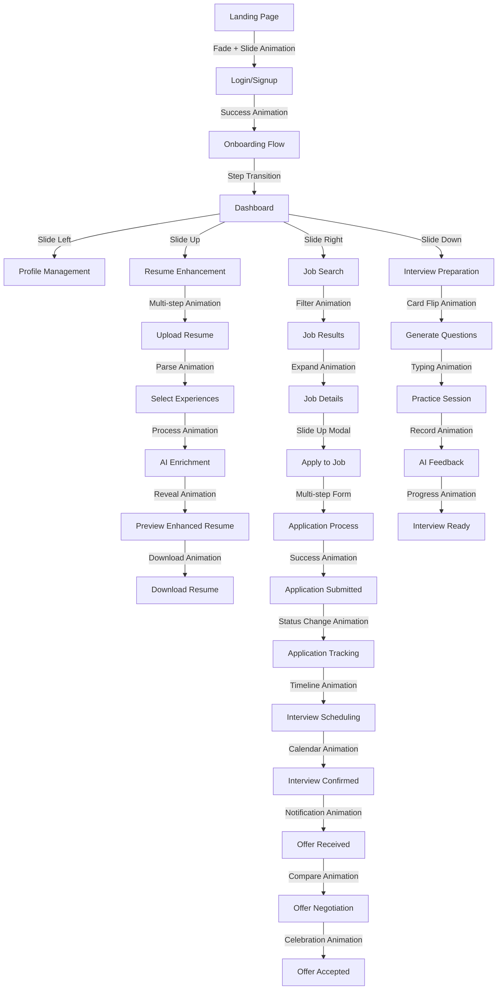
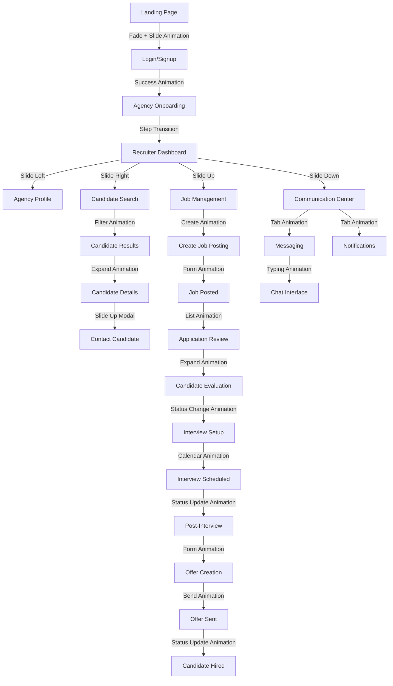
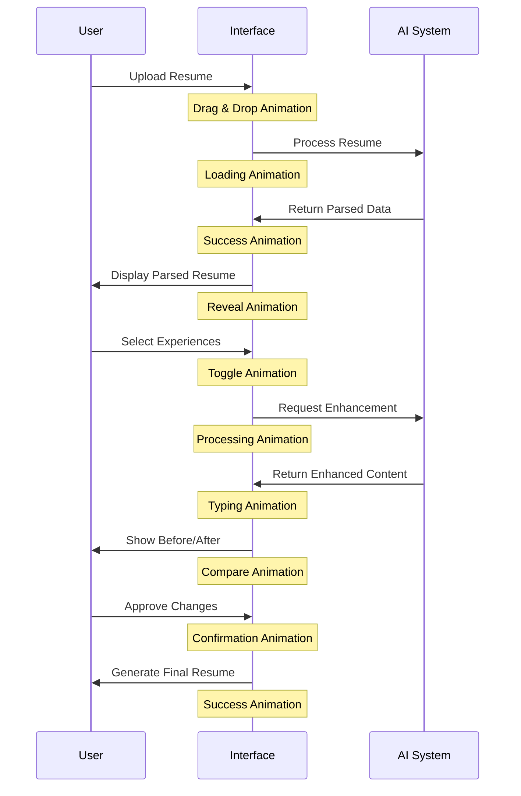
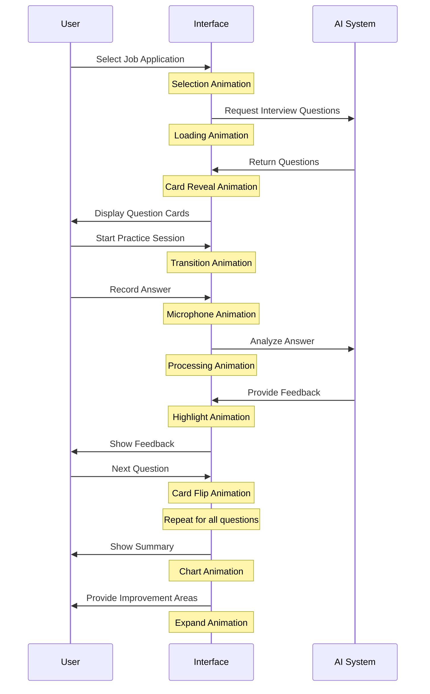
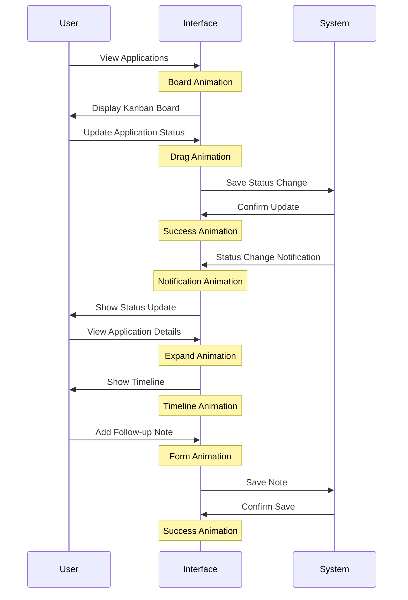
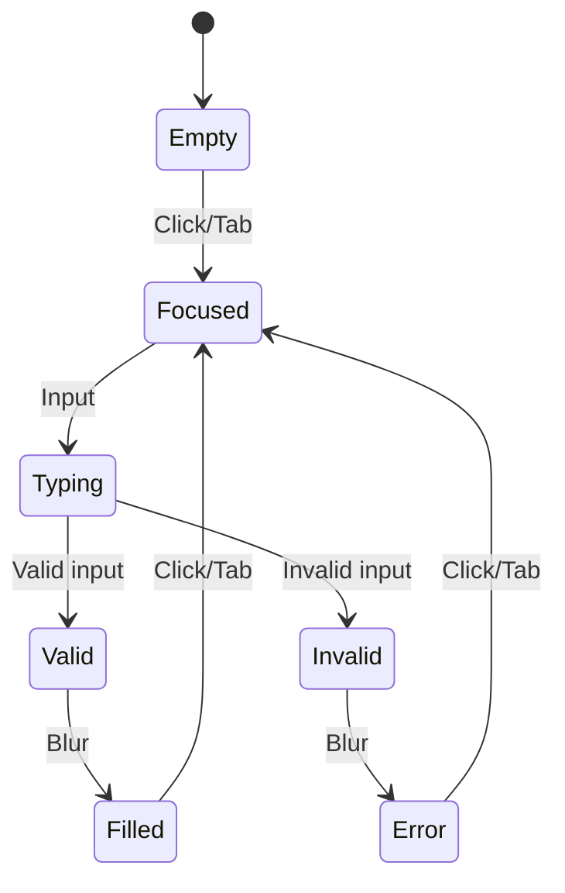
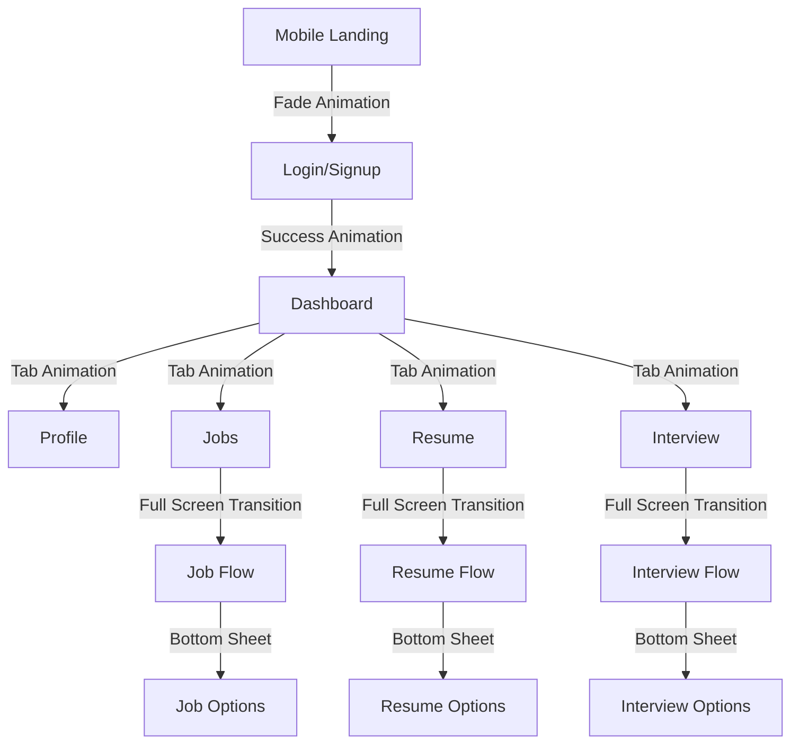

# AI Career - User Journey Map

## Overview

This document provides a visual representation of the user journeys through the AI Career platform, highlighting key transitions, animations, and interaction points. It serves as a companion to the UI/UX Design Guide and Implementation Plan.

## Job Seeker Journey Map



## Recruiter Journey Map



## Key Interaction Points & Animations

### 1. Resume Enhancement Flow



### 2. Interview Preparation Flow



### 3. Job Application Tracking Flow



## Page Transition Matrix

| From | To | Animation Type | Duration | Easing |
|------|------|---------------|----------|--------|
| Landing | Login | Fade + Slide | 300ms | ease-out |
| Login | Dashboard | Zoom + Fade | 400ms | ease-in-out |
| Dashboard | Any Section | Slide Direction | 300ms | ease-in-out |
| List View | Detail View | Expand | 250ms | ease-out |
| Form Step | Next Step | Slide Left | 300ms | ease-in-out |
| Form Step | Previous Step | Slide Right | 300ms | ease-in-out |
| Modal Open | - | Scale + Fade | 200ms | ease-out |
| Modal Close | - | Scale + Fade | 150ms | ease-in |
| Notification | - | Slide Down + Fade | 200ms | ease-out |
| Success State | - | Scale + Color | 300ms | spring(1, 0.3) |

## Micro-interactions

### Button States

```mermaid
stateDiagram-v2
    [*] --> Default
    Default --> Hover: Mouse over
    Hover --> Active: Mouse down
    Active --> Focus: Mouse up
    Focus --> Default: Mouse out
    Default --> Disabled: Disable
    Disabled --> Default: Enable
    Default --> Loading: Submit
    Loading --> Success: Complete
    Loading --> Error: Fail
    Success --> Default: Reset
    Error --> Default: Reset
```

### Form Field States



## Mobile-specific Journey Adaptations

For mobile devices, the following adaptations are made to the user journey:

1. **Simplified Animations**
   - Reduced motion magnitude
   - Shorter durations (200ms vs 300ms)
   - Fewer parallel animations

2. **Navigation Adjustments**
   - Bottom sheet modals instead of side panels
   - Full-screen transitions instead of partial overlays
   - Bottom navigation bar instead of side navigation

3. **Interaction Adjustments**
   - Larger touch targets
   - Swipe gestures for navigation
   - Pull-to-refresh for content updates



## Responsive Behavior Map

| Component | Mobile (<640px) | Tablet (640-1024px) | Desktop (>1024px) |
|-----------|-----------------|---------------------|-------------------|
| Navigation | Bottom tabs | Side drawer | Persistent sidebar |
| Dashboard | Stacked cards | 2-column grid | 3-column grid |
| Forms | Full screen steps | Panel steps | Inline steps |
| Modals | Full screen | 80% width | 50% width |
| Lists | Vertical scroll | 2-column grid | 3-column grid |
| Details | Accordion sections | Tabbed sections | Side-by-side sections |
| Animations | Minimal | Moderate | Full |

## Accessibility Considerations in the Journey

Each step in the user journey includes these accessibility adaptations:

1. **Motion Sensitivity**
   - All animations respect `prefers-reduced-motion`
   - Alternative static transitions available

2. **Keyboard Navigation**
   - Full journey navigable via keyboard
   - Focus indicators visible at all times
   - Logical tab order maintained

3. **Screen Reader Support**
   - ARIA live regions for dynamic content
   - Status announcements for transitions
   - Descriptive labels for interactive elements

4. **Color and Contrast**
   - All UI elements meet WCAG AA standards
   - Animations don't rely solely on color changes
   - Focus states visible in all color schemes
